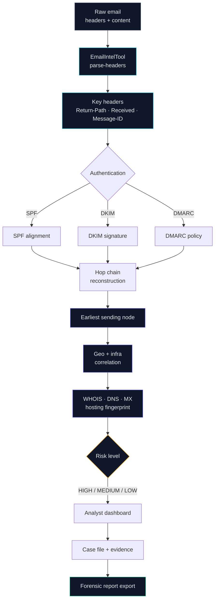
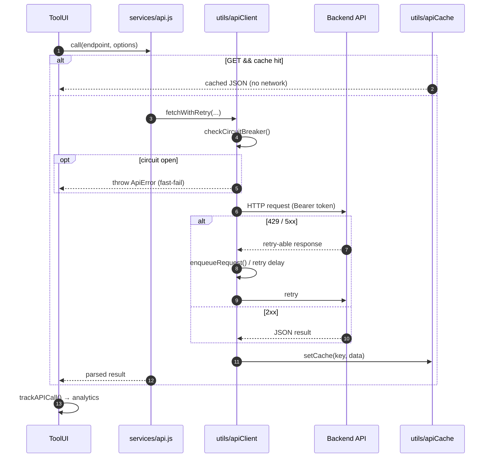
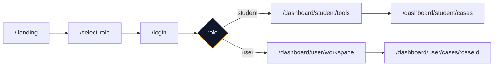

<div align="center">

<a name="top"></a>

<div style="border-radius:16px; background-color:#0f1729; padding:28px 16px 20px;">


<span style="font-family:'Papyrus','PapyrusLT',fantasy,serif; font-weight:bold; font-size:56px; letter-spacing:2px; line-height:1.15;">
  <abbr title="O · Open-source"><span style="color:#ffffff;">O</span></abbr><abbr title="s · signals"><span style="color:#f1f8ff;">s</span></abbr><abbr title="i · intelligence"><span style="color:#e0f0ff;">i</span></abbr><abbr title="n · network"><span style="color:#c4e7ff;">n</span></abbr><abbr title="t · tracing"><span style="color:#9dd6ff;">t</span></abbr><abbr title="X · eXpansion — the crosshair on the threat"><span style="color:#38bdf8; text-shadow:0 0 6px rgba(56,189,248,1),0 0 18px rgba(56,189,248,.85),0 0 38px rgba(2,132,199,.7);">X</span></abbr><span style="color:#7dd3fc;">▍</span>
</span>

<div align="center">
<details align="center">
<summary><b>⌖ Decode the call-sign</b></summary>

*Hover any letter above — each one carries its meaning.*

| Letter | Meaning |
|---|---|
| `O` | **O**pen-source intelligence |
| `s` | **s**ignals & signatures |
| `i` | **i**ntelligence fusion |
| `n` | **n**etwork footprinting |
| `t` | **t**race & attribution |
| `X` | **X** — eXpansion · the crosshair on the threat |

</details>
</div>

<span style="color:#94a3b8; font-size:15px;">AI-Powered Email Threat Detection · GeoLocation &amp; Forensic Intelligence Platform</span>

</div>

[](https://react.dev)
[](https://vite.dev)
[](https://tailwindcss.com)
[](#-tool-arsenal-65)
[](#-deployment)
[](#-license)

**[Overview](#-overview) · [Forensics Pipeline](#-email-forensics-pipeline) · [Tool Arsenal](#-tool-arsenal-65) · [Quick Start](#-quick-start) · [Demo](#-demo-mode) · [Deploy](#-deployment) · [Contribute](#-contributing) · [License](#-license)**

</div>

---

## 🔰 Overview

OSINTX is a **React + Vite single-page application** that turns raw email data into
**actionable threat intelligence**. Phishing, impersonation, business-email-compromise,
and credential-theft campaigns rely on spoofed domains, forged sender identities,
AI-generated language, and relay chains that slip past signature-based filters. OSINTX
closes that gap: it ingests email content, headers, and sender metadata, parses
**SPF/DKIM/DMARC** authentication records, reconstructs the delivery path, and correlates
geo and domain cues — then presents the findings through **role-based dashboards**,
**case files**, and **forensic reports**. It is detection *and* investigation: an analyst
sees the risk level, where the message originated, and the infrastructure behind it.

> [!NOTE]
> This repo is the **frontend only** — the presentation and orchestration layer.
> It talks to a backend over `VITE_API_URL` (default `http://localhost:5000/api`),
> and runs fully offline in [demo mode](#-demo-mode) without one.

The shell is framework-typical but production-minded: a lazy-loaded router, 13 context
providers for shared state, a resilient API client (retry · circuit breaker · cache ·
request queue), a strict **credit-based** usage model, and 65 single-purpose investigation
tools behind **role-based dashboards** (student vs. investigator).

<div align="center">

**65** single-purpose tools &nbsp;·&nbsp; **13** context providers &nbsp;·&nbsp; **27** screens
&nbsp;·&nbsp; **182** source modules &nbsp;·&nbsp; **≈ 77k** lines of code

</div>

---

## ✨ Features

| Area | What's implemented |
|---|---|
| **Email forensics** | Raw header parser, SPF/DKIM/DMARC analysis, hop trace, risk level |
| **Origin tracing** | Earliest-hop IP extraction → geolocation, network + domain correlation |
| **Attribution support** | Threat-intel correlation, breach graph relationships, confidence scoring |
| **Tool arsenal** | 65 single-purpose investigation modules, one shared *input → progress → result* lifecycle |
| **Roles** | Student vs. Investigator dashboards, guarded by `ProtectedRoute` + role checks |
| **Cases & evidence** | Group findings into campaigns/cases; attach evidence; generate reports |
| **Threat map** | Interactive global visualisation (Leaflet + 3D globe via three/fiber) |
| **Resilience** | API retry, circuit breaker, GET caching, in-flight dedup, 429 queue |
| **Auth** | Optional Firebase email/phone auth; `demo-*` tokens for offline use |
| **PWA** | `service-worker.js` + web manifest, offline-capable shell |
| **UX** | Dark/light themes, keyboard shortcuts, credits, search history, notifications |

---

## 🔬 Email Forensics Pipeline

The core flow — from a suspicious email to a geolocated, reportable investigation:



**Implemented in `EmailIntelTool`:** paste raw headers → `POST /tools/email/parse-headers`
→ the response exposes `totalHeaders`, `keyHeaders`, `authentication` (SPF/DKIM/DMARC),
and a per-hop `hops[]` trace — which feed the geo, risk, and attribution views above.

---

## 🧰 Tech Stack

| Layer | Library | Notes |
|---|---|---|
| Core | **React 18.3** | `createRoot` SPA, lazy routes |
| Build | **Vite 5.4** | dev port `3000`, `allowedHosts: osintx.loca.lt`, `manualChunks` vendor split |
| Routing | **react-router 6.28** | nested role trees, lazy `React.lazy` |
| Styling | **Tailwind 3.4** | JIT, single global stylesheet |
| Motion | **framer-motion 11** | page/component transitions |
| Maps / 3D | **Leaflet 1.9 · react-simple-maps** | + **three 0.160 · fiber · drei** for the globe |
| Icons | **lucide-react 0.454** | |
| State | **React Context ×13** | no external store — tree of providers |
| Auth (opt) | **firebase 10.14** | email/phone auth path |
| Lint | **ESLint 9** | ⚠️ flat config not yet set up — `lint` currently fails at config load |

---

## 📁 Project Structure

<details>
<summary><b>◈ Expand: full source tree</b></summary>

```
frontend/
├─ src/
│  ├─ components/
│  │  ├─ tools/           ← 65 investigation tools (one file = one tool)
│  │  ├─ case/            ← case-file building blocks
│  │  ├─ reports/         ← forensic report view/generation
│  │  ├─ terminal/        ← investigation terminal UI
│  │  ├─ ai/              ← AI-assistant components
│  │  ├─ threat-map/      ← map + 3D globe
│  │  ├─ auth/            ← login/signup UI
│  │  └─ common/          ← shared reusable UI
│  ├─ pages/              ← screens (landing, login, dashboards…)
│  ├─ context/            ← 13 providers (see table below)
│  ├─ services/           ← API layer (api.js) + domain services
│  ├─ utils/              ← apiClient, apiCache, requestQueue, analytics,
│  │                         export, sanitizer, captcha, pwa, performance…
│  ├─ routes/             ← AppRoutes.jsx (route table + guards)
│  ├─ config/             ← firebase config, app config
│  └─ main.jsx            ← entry point
├─ public/                ← static assets, service-worker.js, manifest.json
├─ .env.example           ← configuration reference
└─ vite.config.js        ← build/dev config, vendor chunking
```

</details>

<details>
<summary><b>◈ Expand: the 13 context providers at a glance</b></summary>

| Provider | Responsibility |
|---|---|
| `AuthContext` | auth token, session restore from `localStorage`, demo login |
| `RoleContext` | student / investigator role + guards |
| `SessionContext` | current session info |
| `ThemeContext` | dark/light theme |
| `CreditContext` | credit balance, spend on tool runs |
| `HistoryContext` / `SearchHistoryContext` | run & search history |
| `CaseContext` | case files, selected case |
| `EvidenceContext` | evidence items inside a case |
| `ActivityContext` | recent activity feed |
| `TelegramContext` | Telegram-analysis state |
| `SettingsContext` | app-wide settings |
| `ToolResultContext` | result hand-off between tool & save flows |

</details>

---

## 🏗️ Architecture — request lifecycle

Every tool call flows through the same resilient client pipeline:



<details>
<summary><b>◈ Expand: notes for maintainers</b></summary>

- `fetchWithAuth` composes auth headers, setting `Content-Type` only for non-`FormData`.
- `ApiError` carries `status` + raw `data` for caller-side branching.
- Auth token is mirrored to `localStorage` under `osintx_token`.
- GET requests round-trip through `utils/apiCache`; mutations call `invalidateCache`.
- Every call is wired to `utils/analytics.trackAPICall` and protected by the request queue.

</details>

---

## 🧭 Route Map

All routes live in `src/routes/AppRoutes.jsx` behind `ProtectedRoute` (`allowedRoles`).

| Route | Page | Guard |
|---|---|---|
| `/` → `*` | Landing + 404 | public |
| `/select-role` · `/login` · `/signup` · `/auth/callback` | Auth flow | public |
| `/dashboard` | Role-aware redirect | authed |
| `/dashboard/student/*` | Student dashboard, tools, cases, profile, settings, search, help, notifications, progress, feedback, telegram | role `student` |
| `/dashboard/user/*` | Investigator workspace, cases, evidence, settings, notifications, recharge, telegram | role `user` |



---

## 🧰 Tool Arsenal (65)

All tools implement one shared **input → progress → result** contract, so each one is a
single addable file. **Check off the ones you use — this doubles as a living inventory.**

- [ ] `SherlockTool` — username profile enumeration
- [ ] `SocialAnalyzerTool` / `SocialProfilerTool` / `TwitterTool` — social analysis
- [ ] `AvatarReverseTool` — avatar reverse lookup
- [ ] `DiscordScannerTool` / `TelegramAnalyzerTool` — messenger analysis
- [ ] `EmailIntelTool` / `GHuntTool` / `GoogleTakeoutTool` — email / Google data
- [ ] `PhoneInfogaTool` / `PhoneOsintTool` / `WhatsAppTraceTool` — phone numbers
- [ ] `DomainAnalysisTool` / `WhoisLookupTool` / `DNSRecordsTool` / `DNSHistoryTool` / `DNSBruteForceTool` / `SubdomainTool` — domains & DNS
- [ ] `WaybackTool` / `URLScannerTool` / `URLExpanderTool` / `LinkPreviewTool` / `WebsiteScreenshotTool` — URLs
- [ ] `TechDetectorTool` / `WebProfilerTool` / `WebCarbonTool` — websites
- [ ] `IPIntelligenceTool` / `IPQualityTool` / `MACLookupTool` / `PortScannerTool` / `IoTScannerTool` / `WiFiGeoTool` — network
- [ ] `BreachDatabaseTool` / `BreachGraphTool` / `DarkWebSearchTool` / `DarkWebCrawlerTool` / `ThreatIntelTool` — breach / dark web
- [ ] `MalwareCheckTool` / `SafeBrowsingTool` / `CVELookupTool` / `PasteSearchTool` / `PasswordPwnedTool` — security
- [ ] `SanctionsSearchTool` / `InterpolNoticesTool` — compliance
- [ ] `CryptoTracerTool` / `CryptoGraphTool` — blockchain
- [ ] `ReverseImageSearchTool` / `ImageForensicsTool` / `SteganographyTool` / `DocumentMetadataTool` / `MetadataStripTool` — media & files
- [ ] `HARAnalyzerTool` / `FlightTrackerTool` / `GeolocationTool` / `GeoAITool` / `CalendarScannerTool` / `VINDecoderTool` — data forensics
- [ ] `NameAnalyzerTool` / `EncoderDecoderTool` / `HashAnalyzerTool` / `DataMiningTool` / `BrandDetectorTool` / `CertificateSearchTool` / `SentimentAnalyzerTool` — analysis utilities

> [!TIP]
> **Adding a tool?** Scaffold one file in `src/components/tools/<Name>Tool.jsx`
> wired through the same input/result API — see [Contributing](#-contributing).

---

## 🚀 Quick Start

```bash
npm install
npm run dev            # → http://localhost:3000
```

Production build & serve:

```bash
npm run build
npm run preview
```

<kbd>npm run build</kbd> — verified passing. <kbd>npm run lint</kbd> — ⚠️ fails on ESLint
9 flat-config, tracked as an open task.

---

## 🧪 Demo Mode

Intended for local development **without a backend**: the auth layer accepts a token shaped
`demo-${role}` and restores the session from `localStorage` on reload.

| Token | Role | Result |
|---|---|---|
| `demo-student` | student | Student dashboard |
| `demo-user` | user | Investigator dashboard |

Both tokens start with **100 credits**. Implemented in `AuthContext.checkAuth`; default
balances and fixtures come from the role providers.

### ⌨️ Global shortcuts

| Shortcut | Action |
|---|---|
| <kbd>Ctrl</kbd> + <kbd>K</kbd> | Open global search |
| <kbd>Ctrl</kbd> + <kbd>/</kbd> | Show shortcuts help |
| <kbd>Esc</kbd> | Close modal |
| <kbd>Ctrl</kbd> + <kbd>H</kbd> | Go to home |
| <kbd>Ctrl</kbd> + <kbd>Shift</kbd> + <kbd>H</kbd> | Show history |
| <kbd>Ctrl</kbd> + <kbd>B</kbd> | Show bookmarks |

Registered once via `utils/keyboardShortcuts.registerDefaultShortcuts`.

---

## 🚢 Deployment

Any static host (Vercel, Netlify, Cloudflare Pages, nginx/VPS):

1. Build → `npm run build`
2. Serve `dist/`
3. Set env vars on the host (esp. `VITE_API_URL`, Firebase keys if auth is desired)
4. Point a `404.html`/SPA-fallback rule to `index.html`

The pre-configured `allowedHosts` entry enables tunneled previews on `osintx.loca.lt`.
`public/service-worker.js` + `manifest.json` ship with the build for PWA installability.

---

## 🤝 Contributing

1. **Fork** → branch `feat/`, `fix/`, or `tool/<name>`.
2. **Conventions** — API calls in `services/`, one tool per file in `components/tools/`,
   shared state in `context/`. Match the existing `input → result` tool contract.
3. **Verify** — `npm run build` must pass before opening a PR.
4. **Environment** — never commit `.env`; add new keys to `.env.example`.
5. **Lint** — if you migrate to `eslint.config.js`, update this README's ⚠️ note and close
   the open lint task.

---

## 🛡️ Ethics, Legal & Evidentiary Standards

Built for **law enforcement, accredited research, institutional security, and education** —
never for harassment, stalking, or abuse. Users and maintainers agree to:

- 🔒 **Authorisation** — investigate *only* data you are legally authorised to access. *Public ≠ yours to use.*
- 🧾 **Leads, not facts** — every result is investigative intelligence; cross-verify before action.
- 🗃️ **Chain of custody** — use cases + evidence flows to preserve provenance for institutional review and law-enforcement handoff.
- 🌍 **Jurisdiction & privacy** — respect platform terms, local law, and data-protection rules; apply retention/masking as configured.
- 🚫 **No covert evasion** — no stealth or evasion features; honest collection of open data only.
- 🛟 **Harm is a bug** — any feature that could enable stalking or harm is reported and treated as a critical issue.

---

## 📄 License

`UNLICENSED` · All rights reserved · private project. No redistribution without written permission.

---

**[↑ Back to top](#top)**
